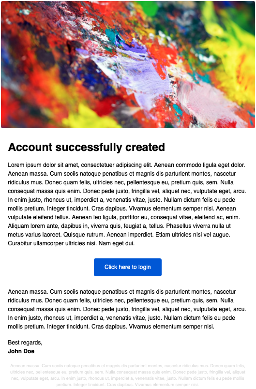

# MailTemplateDuck
(Laravel) Components for email, for lazy people ✉️💚

> ⚠️ **This package is still in development.**

## Usage
### Create array of components

```php
$components = [
    new HeaderImageComponent("https://source.unsplash.com/user/traceofwind/likes/800x400"),
    new SpacerComponent(30),
    new TitleComponent("Account successfully created"),
    new SpacerComponent(20),
    new ParagraphComponent(TestData::$loremIpsum),
    new SpacerComponent(30),
    new CtaButtonComponent("Click here to login", "https://www.google.com", "center"),
    new SpacerComponent(30),
    new ParagraphComponent(TestData::$smallLoremIpsum),
    new SpacerComponent(20),
    new ParagraphComponent(TestData::$signature),
    new SpacerComponent(20),
    new DisclaimerComponent(TestData::$smallLoremIpsum),
];
```

### Set options
```
$options = [
    'background_color' => '#dddddd',
    'accent_color' => '#ff0000',
];
```

### Create HTML content
```php
$html = MailTemplateDuck::create($components, $options);
```

## Example
