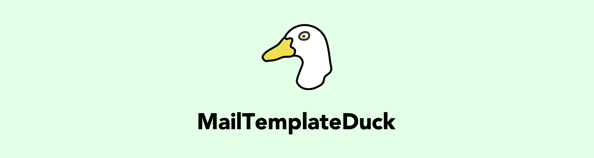

# MailTemplateDuck
Laravel Components for email, for lazy people ✉️💚

### Create array of components
```php
$components = [
new HeaderImageComponent("https://source.unsplash.com/user/traceofwind/likes/800x400"),
new SpacerComponent(30),
new TitleComponent("Account successfully created"),
new SpacerComponent(20),
new ParagraphComponent(TestData::$loremIpsum),
new SpacerComponent(20),
new CtaButtonComponent("Click here to login", "https://www.google.com", "center"),
new SpacerComponent(20),
new ParagraphComponent(TestData::$loremIpsum),
new SpacerComponent(20),
new ParagraphComponent(TestData::$signature),
];
```
### Set options
```
$options = [
'background_color' => '#dddddd',
'accent_color' => '#ff0000',
];
```

### Create HTML content
```php
$mailDuck = MailTemplateDuck::create($components, $options);

echo $mailDuck;
```